# Ontology Platform 튜토리얼

이 튜토리얼에서는 **Company Ontology** 예제를 처음부터 끝까지 만들어 보며 Ontology Platform의 주요 기능을 익힙니다.

## 목차

1. [온톨로지 생성](#1-온톨로지-생성)
2. [Concept(클래스) 추가](#2-concept클래스-추가)
3. [Relation(프로퍼티) 추가](#3-relation프로퍼티-추가)
4. [Individual(인스턴스) 추가](#4-individual인스턴스-추가)
5. [SPARQL로 데이터 조회](#5-sparql로-데이터-조회)
6. [외부 온톨로지 Import](#6-외부-온톨로지-import)
7. [Graph 시각화](#7-graph-시각화)
8. [Reasoner 실행](#8-reasoner-실행)

---

## 1. 온톨로지 생성

애플리케이션에 접속하면 **홈페이지**에 현재 등록된 온톨로지 목록이 카드 형태로 표시됩니다.

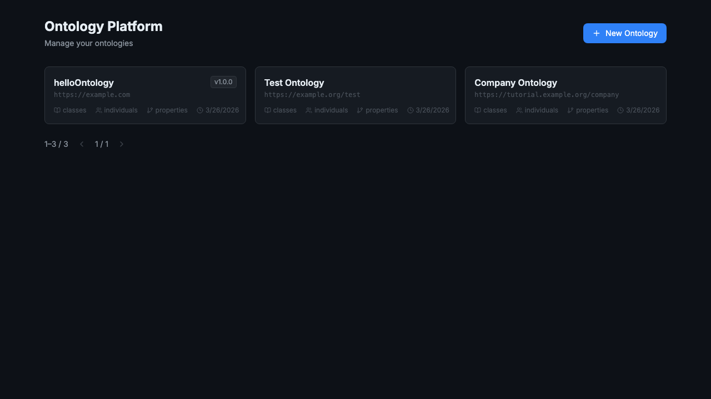

각 카드에는 온톨로지 이름, Base IRI, 클래스/인스턴스/프로퍼티 수, 최종 수정일이 표시됩니다.

새 온톨로지를 만들려면 우측 상단의 **+ New Ontology** 버튼을 클릭합니다.

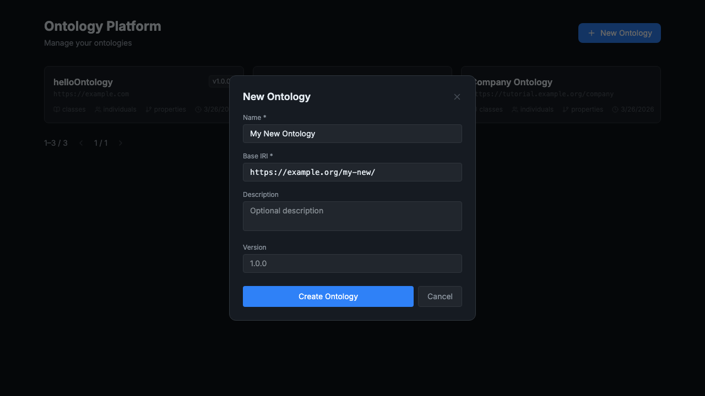

| 필드 | 설명 | 예시 |
|------|------|------|
| **Name** | 온톨로지의 표시 이름 | `Company Ontology` |
| **Base IRI** | 온톨로지의 기본 식별자 URI | `https://tutorial.example.org/company` |
| **Description** | 온톨로지 설명 (선택) | `회사 도메인 온톨로지 예제` |
| **Version** | 버전 문자열 (선택) | `1.0.0` |

값을 입력하고 **Create** 버튼을 누르면 온톨로지가 생성되고 해당 온톨로지의 상세 페이지로 이동합니다.

---

## 2. Concept(클래스) 추가

온톨로지 상세 페이지의 상단 탭에서 **Entities**를 클릭합니다. Entities 페이지는 **Concepts**와 **Individuals** 두 탭으로 구성됩니다.

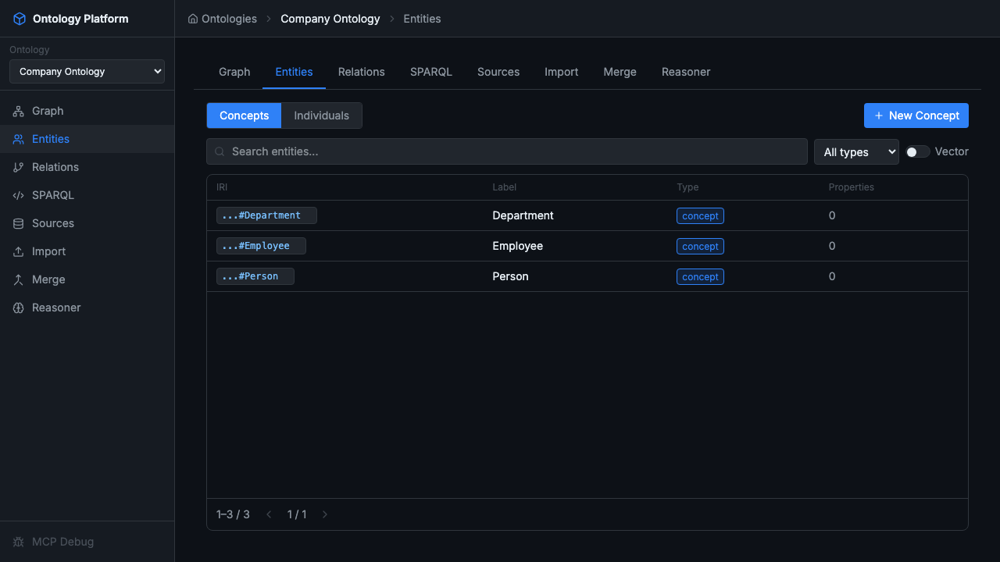

Concepts 탭에는 온톨로지의 OWL 클래스 목록이 표시됩니다. 각 행에는 IRI, 레이블, 타입(`concept`), 프로퍼티 수가 나타납니다.

### 새 Concept 만들기

**+ New Concept** 버튼을 클릭하면 인라인 폼이 열립니다.

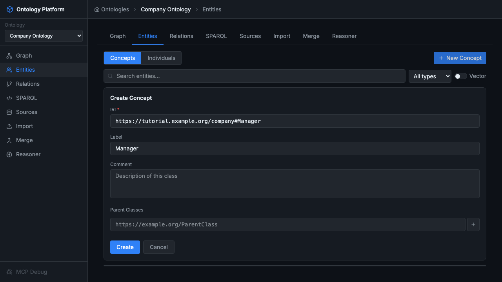

| 필드 | 설명 |
|------|------|
| **IRI** | 클래스의 고유 식별자 (Base IRI + `#ClassName` 권장) |
| **Label** | 사람이 읽기 쉬운 이름 |
| **Comment** | 클래스 설명 |
| **Parent Classes** | 상위 클래스 IRI (상속 관계 설정) |

Company Ontology 예제에서는 다음 세 클래스를 만듭니다:

```
Person     — https://tutorial.example.org/company#Person
Employee   — https://tutorial.example.org/company#Employee  (Parent: Person)
Department — https://tutorial.example.org/company#Department
```

`Employee`에 Parent Classes로 `Person` IRI를 입력하면 `Employee rdfs:subClassOf Person` 관계가 자동으로 추가됩니다.

> **팁:** 검색 창에 텍스트를 입력하면 IRI 또는 레이블 기준으로 실시간 필터링됩니다. **All types** 드롭다운으로 타입별 필터링도 가능합니다.

---

## 3. Relation(프로퍼티) 추가

상단 탭에서 **Relations**를 클릭합니다.

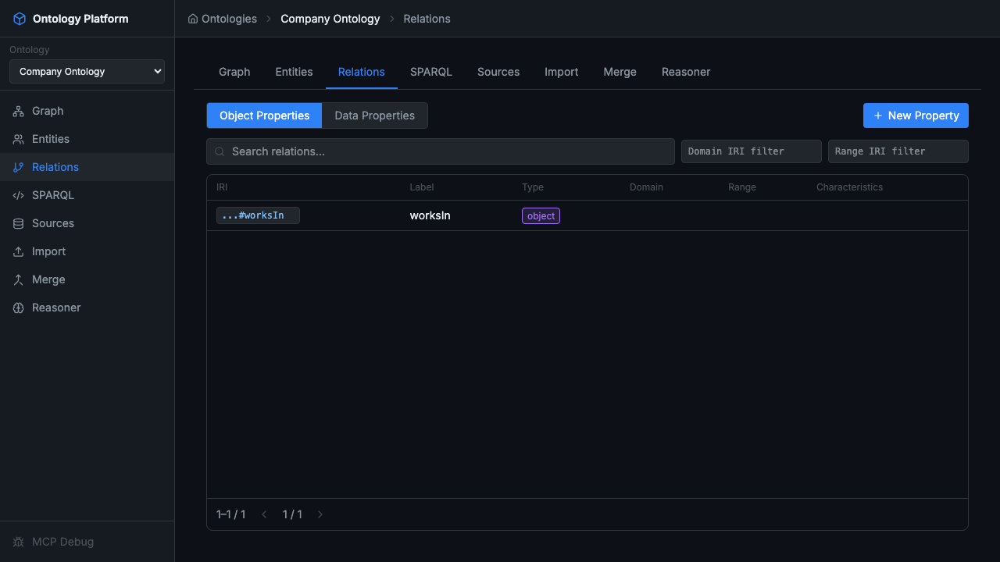

Relations 페이지는 **Object Properties**(객체 간 관계)와 **Data Properties**(데이터 값 속성) 두 탭으로 구성됩니다.

**+ New Property** 버튼을 클릭하여 새 프로퍼티를 추가합니다.

| 필드 | 설명 |
|------|------|
| **IRI** | 프로퍼티 식별자 |
| **Label** | 표시 이름 |
| **Type** | `object` (개체→개체) 또는 `data` (개체→리터럴) |
| **Domain** | 주어 클래스 IRI |
| **Range** | 목적어 클래스/타입 IRI |

예제에서는 다음 Object Property를 만듭니다:

```
worksIn
  IRI:    https://tutorial.example.org/company#worksIn
  Domain: Employee
  Range:  Department
```

이 프로퍼티는 "직원이 특정 부서에서 근무한다"는 관계를 표현합니다.

---

## 4. Individual(인스턴스) 추가

**Entities** 탭으로 돌아가 **Individuals** 버튼을 클릭합니다.

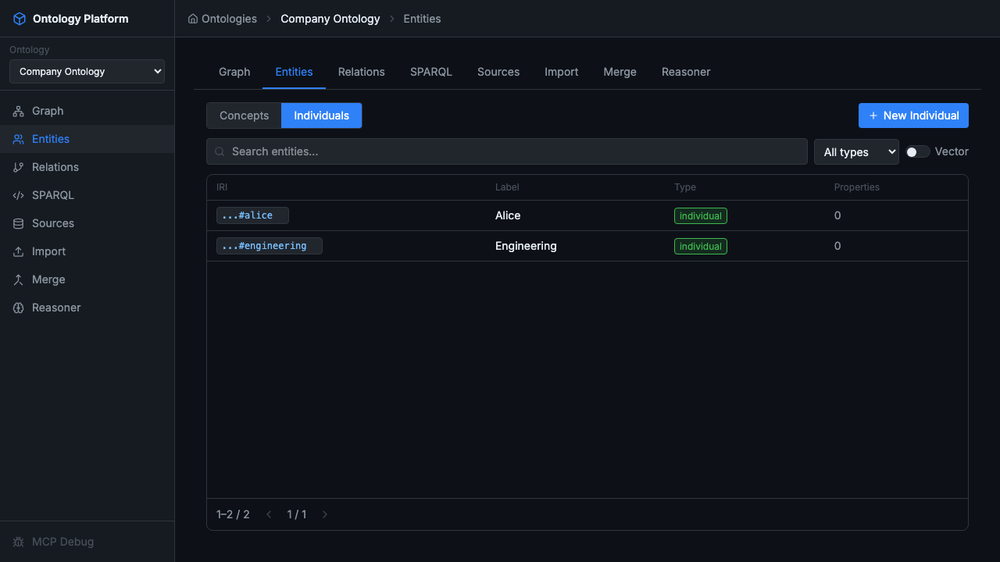

Individuals는 클래스의 구체적인 인스턴스입니다. **+ New Individual** 버튼으로 추가합니다.

예제에서 만드는 개체:

| IRI | Label | Type |
|-----|-------|------|
| `...#alice` | Alice | Employee |
| `...#engineering` | Engineering | Department |

`Type`에 클래스 IRI를 지정하면 `alice rdf:type Employee` 트리플이 저장됩니다.

---

## 5. SPARQL로 데이터 조회

상단 탭에서 **SPARQL**을 클릭하면 SPARQL 쿼리 편집기가 열립니다.

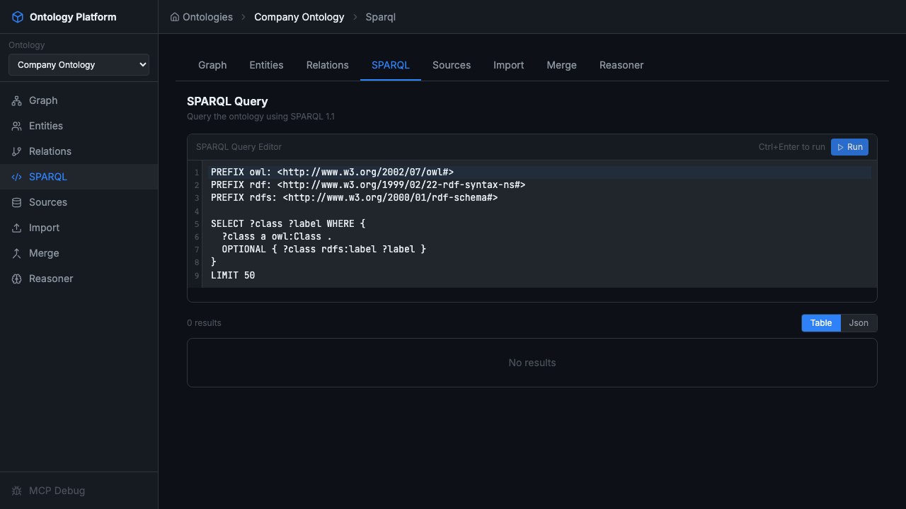

편집기에는 기본 PREFIX 선언과 샘플 SELECT 쿼리가 미리 채워져 있습니다. 쿼리를 수정하고 우측 상단의 **Run** 버튼을 클릭하면 결과가 하단 테이블에 표시됩니다.

### 예시 쿼리

#### 모든 클래스 조회

```sparql
PREFIX owl: <http://www.w3.org/2002/07/owl#>
PREFIX rdfs: <http://www.w3.org/2000/01/rdf-schema#>

SELECT ?class ?label WHERE {
  GRAPH ?g {
    ?class a owl:Class .
    OPTIONAL { ?class rdfs:label ?label }
  }
}
```

#### 특정 타입의 개체 조회

```sparql
PREFIX rdf:  <http://www.w3.org/1999/02/22-rdf-syntax-ns#>
PREFIX rdfs: <http://www.w3.org/2000/01/rdf-schema#>
PREFIX ex:   <https://tutorial.example.org/company#>

SELECT ?person ?label WHERE {
  GRAPH ?g {
    ?person rdf:type ex:Employee .
    OPTIONAL { ?person rdfs:label ?label }
  }
}
```

> **키보드 단축키:**
> - `Ctrl+Enter` / `Cmd+Enter` — 쿼리 실행
> - `Ctrl+A` / `Cmd+A` — 전체 선택

---

## 6. 외부 온톨로지 Import

기존에 정의된 온톨로지를 가져와 재사용할 수 있습니다. **Import** 탭에는 세 가지 방법이 있습니다.

### 파일 업로드

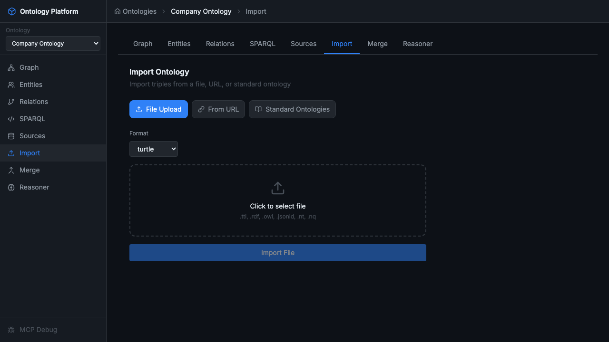

로컬에 저장된 RDF 파일을 드래그하거나 클릭하여 선택합니다. 지원 형식: `.ttl`, `.rdf`, `.owl`, `.jsonld`, `.nt`, `.nq`

Format 드롭다운에서 파일 형식을 선택한 뒤 **Import File**을 클릭합니다.

### URL에서 Import

**From URL** 탭에서 원격 RDF 파일의 URL을 직접 입력하여 가져올 수 있습니다.

### 표준 온톨로지 Import

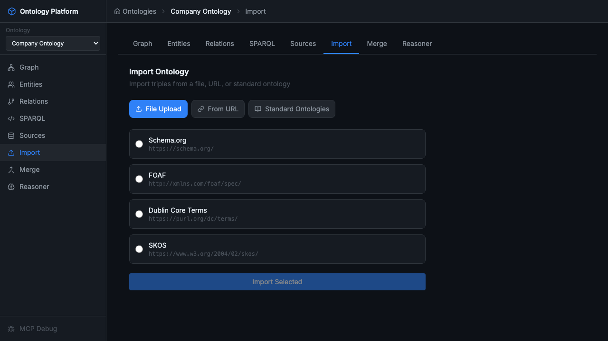

**Standard Ontologies** 탭에서는 자주 사용되는 공개 온톨로지를 원클릭으로 추가할 수 있습니다.

| 온톨로지 | URL | 설명 |
|----------|-----|------|
| **Schema.org** | https://schema.org/ | 웹 구조화 데이터 표준 어휘 |
| **FOAF** | http://xmlns.com/foaf/spec/ | 사람·소셜 네트워크 어휘 |
| **Dublin Core Terms** | https://purl.org/dc/terms/ | 메타데이터 표준 |
| **SKOS** | https://www.w3.org/2004/02/skos/ | 지식 조직 시스템 어휘 |

원하는 온톨로지를 선택하고 **Import Selected**를 클릭합니다. 임포트가 완료되면 "Imported N triples" 메시지가 표시됩니다.

---

## 7. Graph 시각화

**Graph** 탭에서 온톨로지의 구조를 시각적으로 탐색할 수 있습니다.

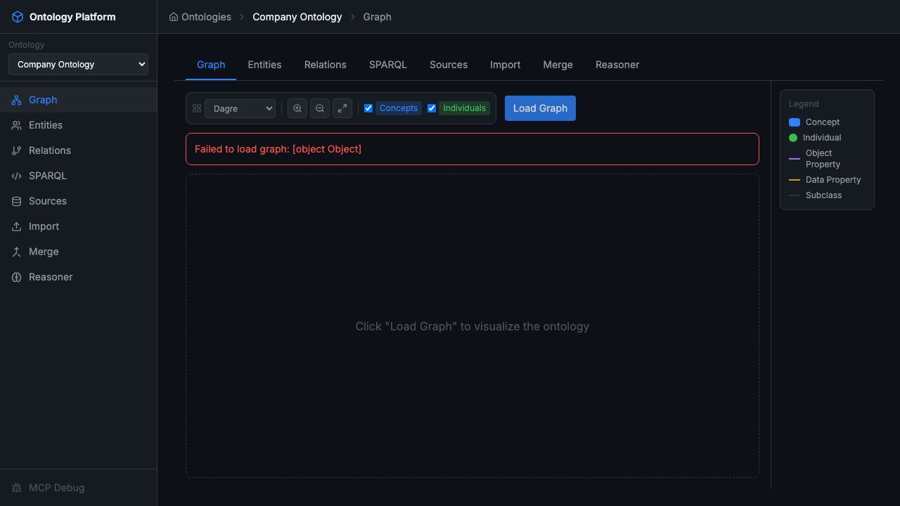

상단 툴바에서 다음을 설정할 수 있습니다:

| 옵션 | 설명 |
|------|------|
| 레이아웃 엔진 | Dagre (계층형), Force-directed 등 |
| **Concepts** 체크박스 | OWL 클래스 노드 표시/숨김 |
| **Individuals** 체크박스 | 인스턴스 노드 표시/숨김 |

**Load Graph** 버튼을 클릭하면 현재 온톨로지의 그래프가 렌더링됩니다.

범례(Legend):
- 🔵 **Concept** — OWL 클래스
- 🟢 **Individual** — 인스턴스
- 보라색 엣지 — Object Property
- 회색 엣지 — Data Property
- 점선 — Subclass 관계

노드를 드래그하여 레이아웃을 조정하고, 스크롤로 줌 인/아웃할 수 있습니다.

---

## 8. Reasoner 실행

**Reasoner** 탭에서 OWL 추론기를 실행하면 온톨로지의 논리적 일관성을 검증하고 암묵적 관계를 추론합니다.

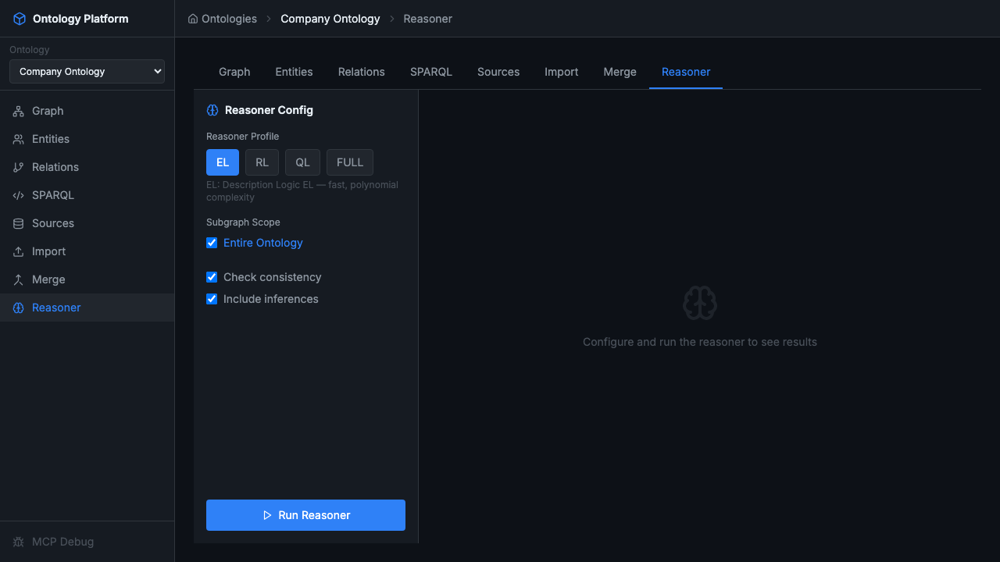

### Reasoner Profile 선택

| 프로파일 | 설명 |
|----------|------|
| **EL** | Description Logic EL — 빠름, 다항 복잡도 |
| **RL** | OWL 2 RL — 규칙 기반, 대규모 데이터에 적합 |
| **QL** | OWL 2 QL — 쿼리 응답 최적화 |
| **FULL** | OWL Full — 완전한 추론, 느림 |

### 옵션

- **Subgraph Scope** — 추론 범위 (전체 온톨로지 또는 특정 서브그래프)
- **Check consistency** — 온톨로지 일관성 검사 (모순 감지)
- **Include inferences** — 추론된 트리플을 결과에 포함

설정 후 **▶ Run Reasoner**를 클릭합니다. 결과 패널에 다음 정보가 표시됩니다:

- **Consistent** / **Inconsistent** — 일관성 여부
- 추론된 클래스 계층 (`Employee ⊑ Person` 등)
- 발견된 오류 또는 경고

> **팁:** `Employee`가 `Person`의 서브클래스로 선언되어 있으면, Reasoner는 `Alice rdf:type Person`도 자동으로 추론합니다.

---

## 다음 단계

- **Merge** 탭 — 두 온톨로지를 병합
- **Sources** 탭 — 온톨로지에 연결된 데이터 소스 관리
- **API 사용** — REST API로 프로그래밍 방식 접근 ([API 레퍼런스](./README.md) 참고)
- **SPARQL Update** — INSERT/DELETE 쿼리로 데이터 수정
